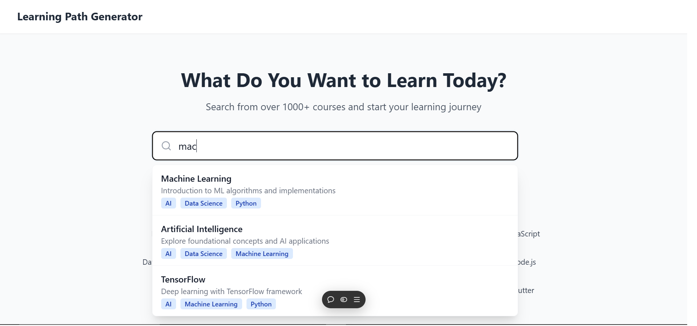
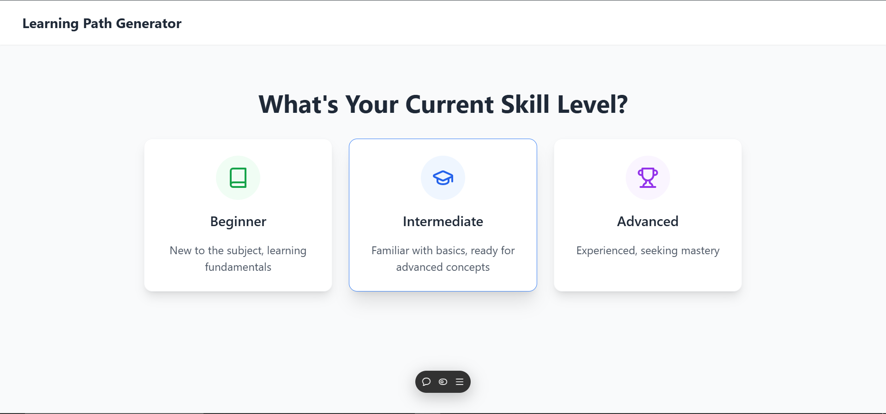
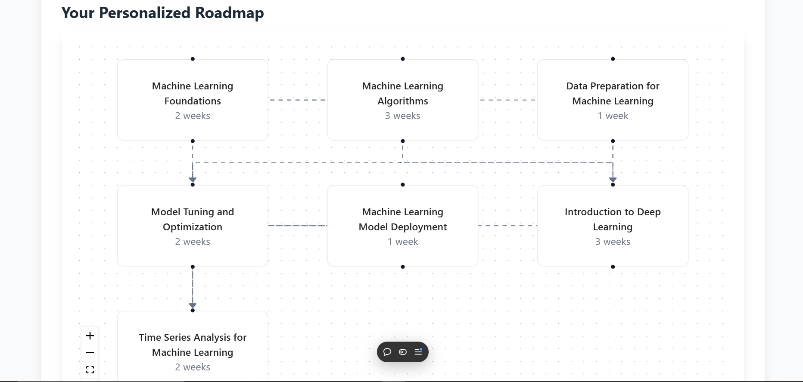

# Daytona Project: Personalized Learning Path Generator

The **Personalized Learning Path Generator** is a cutting-edge web application that generates customized learning paths for users based on their skill levels, scores, and preferences. It integrates the Gemini API for dynamic, data-driven recommendations and ensures a seamless user experience through a modern, interactive interface.

## 🚀 Getting Started

### Open Using Daytona

1. **Install Daytona**: Follow the [Daytona installation guide](https://www.daytona.io/docs/installation/installation/).

2. **Create the Workspace**:  
   ```bash
   daytona create https://github.com/Raghunani12/LearningPathGen
   ```

3. **Start the Application**:  
   Use the appropriate command to start the app (e.g., `npm run dev`).

---

## Features

### User-Friendly Input Form
- Allows users to input learning levels, scores, and preferences.
- Provides real-time feedback and validation for accuracy.

### Dynamic Learning Path Generation
- Fetches personalized learning paths using the Gemini API.
- Tailors recommendations based on user-provided data.

### Interactive UI
- Designed with TailwindCSS for responsiveness and aesthetics.
- Intuitive layout for ease of use.

### Backend Processing
- Securely processes and interacts with the Gemini API using Express.js.
- Handles data validation and error management effectively.

### Error Handling
- Displays clear error messages for invalid inputs or API failures.
- Ensures uninterrupted user experience.

---

## Technologies Used

### Frontend
- React.js (for UI development)
- TailwindCSS (for responsive styling)
- Axios (for API requests)
- Vite (for development and build optimization)
- TypeScript (for type-safe development)

### Backend
- Node.js (for server-side processing)
- Express.js (for API routing)
- Axios (for Gemini API integration)
- TypeScript (for robust backend development)

### API Integration
- Gemini API (for personalized learning path data)

---

## Application Flow

| Feature  | Status       | Description  |
|----------|:-------------:|:-------------|
| Home Page | ✅ | Navigate the application |
| Input Form | ✅ | Add user inputs and preferences |
| Dynamic Path Generation  | ✅ | Generate learning paths using Gemini API |
| Error Handling | ✅ | Display clear messages for invalid inputs |

---

## File Structure

The project is organized as follows:

```bash
/PersonalizedLearningPathGen
├── .gitignore               # Ignored files for version control
├── eslint.config.js         # ESLint configuration for linting
├── index.html               # Entry HTML file
├── package.json             # Project dependencies
├── tailwind.config.js       # TailwindCSS configuration
├── tsconfig.json            # TypeScript configuration
├── vite.config.ts           # Vite configuration for fast builds
├── /src                     # Source code directory
│   ├── /components          # Reusable React components
│   ├── /data                # Static or dynamic data files
│   ├── /store               # State management files
│   ├── App.tsx              # Main app logic
│   ├── index.css            # Global styles
│   ├── main.tsx             # Entry point for React DOM rendering
│   ├── types.ts             # TypeScript type definitions
│   ├── vite-env.d.ts        # Vite environment configuration
```

---

## Screenshots

### Home Page


### Input Form


### Learning Path Output


---

## Deployed Links

- [Live Demo](https://learning-path-gen.vercel.app/)

